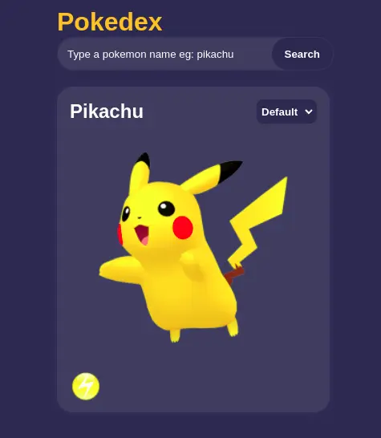

<h1 align="center">Pokedex</h1>

<div align="center">
  <h3>
    <a href="https://pokedex-daniel.netlify.app/">
      Demo
    </a>
  </h3>
</div>

<!-- TABLE OF CONTENTS -->

## Table of Contents

- [Overview](#overview)
  - [Built With](#built-with)
- [Features](#features)
- [How to use](#how-to-use)
- [Contact](#contact)
- [Acknowledgements](#acknowledgements)

<!-- OVERVIEW -->

## Overview

;

## [Acknowledgements](#acknowledgements)

This app is created in order to see the fruits of what I learned in ClojureScript.

### Built With

- [CSS](https://developer.mozilla.org/en-US/docs/Web/CSS)
- [ClojureScript](https://clojurescript.org/)

## Features

- [PokeApi](https://pokeapi.co/)
- [Pokemon Type Icons](https://www.pngegg.com/en/png-fnqpl)

## How To Use

To clone and run this application, you'll need [Git](https://git-scm.com) and [Node.js](https://nodejs.org/en/download/) (which comes with [npm](http://npmjs.com)) installed on your computer. From your command line:

Java JDK 8+ and [Leiningen](https://leiningen.org/) are needed if they don't exist locally.


```bash
# Clone this repository
$ git clone https://github.com/voromahery/pokedex

# Install dependencies
$ npm install

# Run the app
$ npm start
```

## Contact

- Email: daniel.her@onja.org
- GitHub [voromahery](https://github.com/voromahery)
